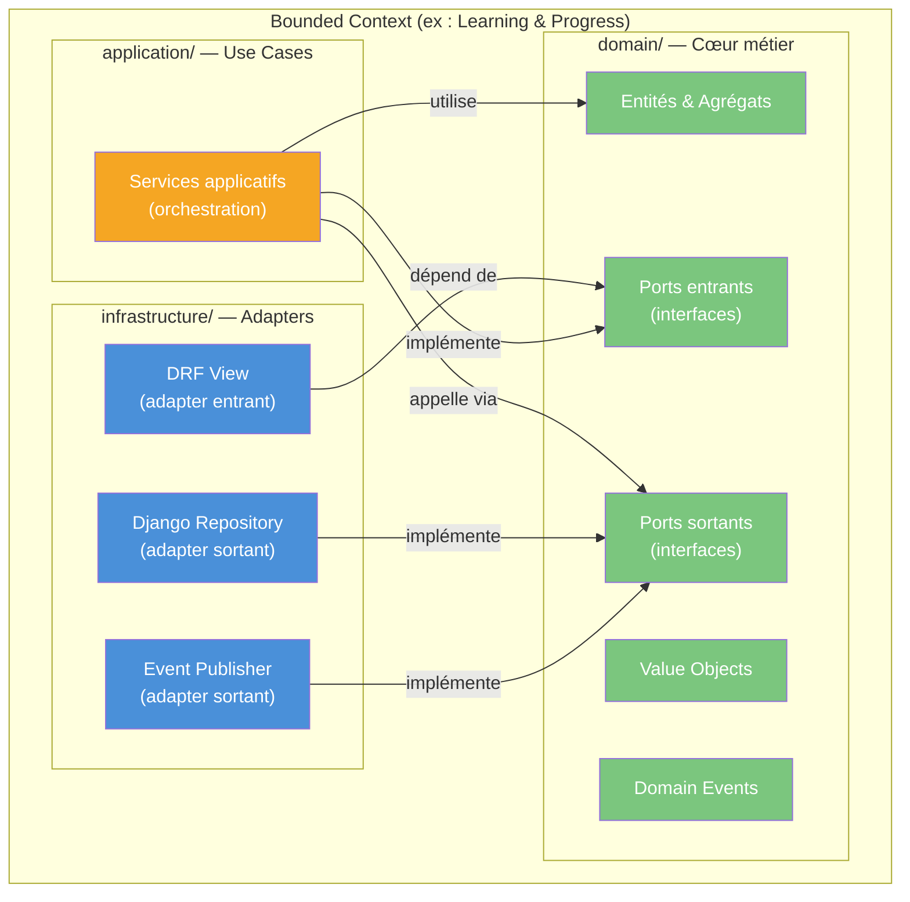
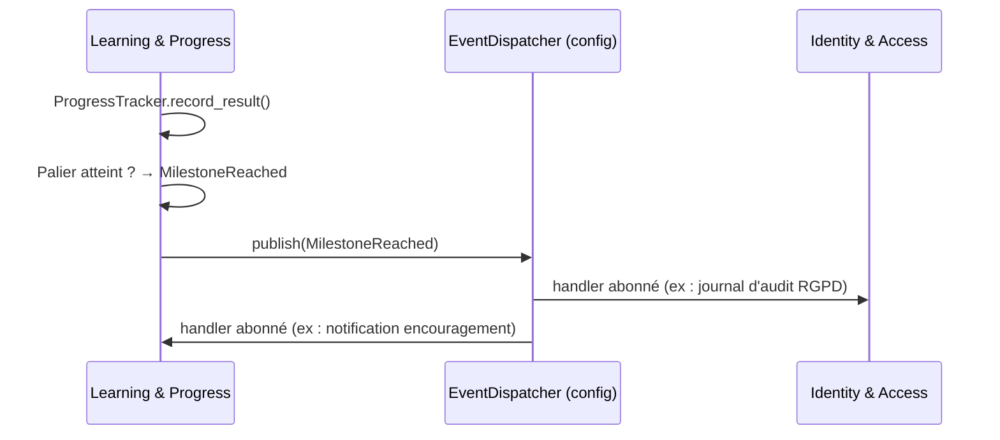
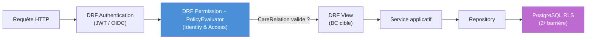
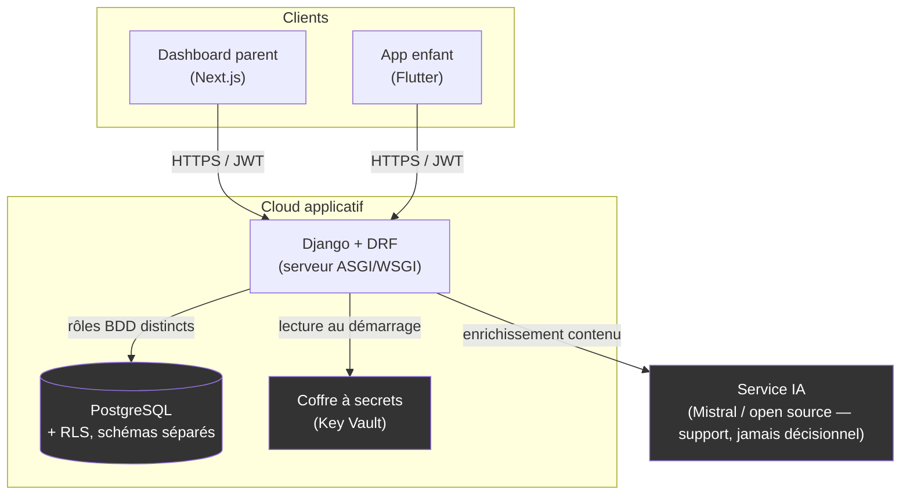

> **Statut** : ✅ réalisé · **Couvre** : Bloc 2 — C2.1

# Architecture Technique Backend — Monolithe Modulaire (Python / Django)

> **Projet** : Lenny & Co — plateforme d'accompagnement des enfants porteurs de troubles DYS.
> **Périmètre** : conception backend. **Stack actée (avril 2026)** : Python 3.12+ · Django 5.x · Django REST Framework · PostgreSQL.

---

## Résumé architectural (à lire en premier)

Le backend de Lenny & Co est un **monolithe modulaire** organisé en **deux bounded contexts** — *Identity & Access* (authentification, comptes, relations de soin, contrôle d'accès) et *Learning & Progress* (exercices, progression, encouragements). À l'intérieur de chaque contexte, nous appliquons une **architecture hexagonale** (ports & adapters) : un cœur de domaine écrit en **Python pur**, découplé de Django, entouré d'une couche applicative d'orchestration et d'une couche d'infrastructure portant les détails techniques (DRF, ORM, persistance).

Le projet est mené par une développeuse unique. Trois partis pris structurent l'ensemble : (1) le monolithe modulaire offre la rigueur de séparation du DDD sans la charge opérationnelle des microservices ; (2) l'isolation des frontières entre contextes est assurée par une **fitness function d'architecture** (`import-linter`) exécutée en intégration continue, faute de barrière native au langage ; (3) le découplage du domaine vis-à-vis de l'ORM actif de Django est obtenu par un **mapping Data Mapper explicite** — ce « combat contre l'ORM » est assumé comme une preuve de maîtrise architecturale et non comme un coût subi.

La sécurité repose sur une **double barrière** : un contrôle d'accès **ABAC** au niveau applicatif (DRF) et la **Row-Level Security** de PostgreSQL au niveau des données. La conformité RGPD est ancrée dans le domaine (*privacy by design*), avec un traitement particulier réservé aux données de santé envisagées en V2 (hébergement **HDS** — hors périmètre MVP, voir §9).

> **Choix de la stack.** Python/Django/DRF a été retenu à l'issue d'un *benchmark technique* (document dédié), face notamment à un écosystème JVM et à Node/Nest. Nous n'en reprenons pas la justification ici : une décision, une justification, à un seul endroit.

---

## Glossaire des sigles

| Sigle | Signification |
|---|---|
| **BC** | **Bounded Context** — frontière logique d'un sous-domaine métier (DDD) |
| **DDD** | **Domain-Driven Design** — conception pilotée par le domaine métier |
| **DRF** | **Django REST Framework** — couche API REST par-dessus Django |
| **ORM** | **Object-Relational Mapping** — ici l'ORM *actif* (Active Record) de Django |
| **VO** | **Value Object** — objet de valeur immuable, sans identité propre (DDD) |
| **ABAC** | **Attribute-Based Access Control** — contrôle d'accès par attributs |
| **RBAC** | **Role-Based Access Control** — contrôle d'accès par rôles (modèle plus simple, écarté) |
| **RLS** | **Row-Level Security** — filtrage des lignes au niveau du moteur PostgreSQL |
| **HDS** | **Hébergeur de Données de Santé** — certification française obligatoire pour les données de santé |
| **SecNumCloud** | Visa de sécurité ANSSI pour les offres cloud souveraines |
| **MCD / MLD / MLDR** | **Modèle Conceptuel / Logique / Logique Relationnel** de Données — niveaux normatifs distincts (cf. §6) |
| **DTO** | **Data Transfer Object** — objet de transport, à la frontière de l'API |
| **DAL** | **Data Access Layer** — couche d'accès aux données (ici les *repositories*) |
| **OIDC** | **OpenID Connect** — couche d'identité au-dessus d'OAuth2 |
| **ASGI / WSGI** | interfaces serveur Python (asynchrone / synchrone) |
| **CI/CD** | **Continuous Integration / Continuous Delivery** |

---

## Sommaire

1. [Style d'architecture : le monolithe modulaire](#1-style-darchitecture--le-monolithe-modulaire)
2. [Stack technique](#2-stack-technique)
3. [Découpage en deux bounded contexts](#3-découpage-en-deux-bounded-contexts)
4. [Structure du projet Django](#4-structure-du-projet-django)
5. [Architecture hexagonale dans un BC](#5-architecture-hexagonale-dans-un-bounded-context)
6. [Le combat contre l'ORM actif : mapping domaine ↔ persistance](#6-le-combat-contre-lorm-actif--mapping-domaine--persistance)
7. [Communication inter-contextes : événements in-process](#7-communication-inter-contextes--événements-in-process)
8. [Sécurité transverse : ABAC + Row-Level Security](#8-sécurité-transverse--abac--row-level-security)
9. [Déploiement, secrets et données de santé](#9-déploiement-secrets-et-données-de-santé)
10. [Stratégie de tests](#10-stratégie-de-tests)
11. [Récapitulatif des règles d'architecture](#11-récapitulatif-des-règles-darchitecture)

---

## 1. Style d'architecture : le monolithe modulaire

### 1.1 Alternatives évaluées

| Critère | Monolithe classique | **Monolithe modulaire** | Microservices |
|---|---|---|---|
| Séparation des domaines | Faible (tout mélangé) | **Forte** (un BC = un module Python isolé) | Maximale (un BC = un service) |
| Complexité opérationnelle | Un déploiement | **Un déploiement** | N déploiements, orchestration, observabilité distribuée |
| Testabilité | Difficile à isoler | **Module testable isolément** | Service testable, mais intégration inter-services lourde |
| Adapté à une équipe d'une personne | Oui, mais dette rapide | **Oui — équilibre rigueur/pragmatisme** | Non — l'ops absorbe le temps métier |
| Cohérence DDD | Faible (frontières non matérialisées) | **Forte** (frontières dans le code) | Forte (frontières = réseau) |

### 1.2 Décision retenue : monolithe modulaire

Trois arguments, et pas un de plus :

- **Ressources humaines.** Le projet est porté par une seule développeuse. La complexité opérationnelle des microservices (conteneurs, communication réseau, tracing distribué) consommerait un temps disproportionné au détriment du métier. Le monolithe modulaire offre la même discipline de séparation sans cette surcharge.
- **Cohérence DDD.** Contrairement au monolithe classique, les frontières de bounded contexts sont **matérialisées dans le code** (packages Python distincts, dépendances contrôlées). Une violation de frontière est détectable automatiquement (cf. §4.3).
- **Évolutivité maîtrisée.** Si la charge ou l'équipe grandit, chaque BC — dont les contrats d'interface sont déjà explicites — peut être extrait en service de manière incrémentale. C'est une migration, pas une réécriture.

### 1.3 Numérique responsable

Un seul processus applicatif au lieu de plusieurs conteneurs, une **communication in-process** sans appels réseau ni sérialisation, et un pipeline CI/CD unique : l'empreinte infrastructure est minimale. Le choix sert directement la compétence transversale « numérique responsable ».

---

## 2. Stack technique

| Composant | Technologie | Justification (1 ligne) |
|---|---|---|
| **Langage** | Python 3.12+ | Maîtrise confirmée (cf. ZenLog) ; `dataclasses` immuables idéales pour les Value Objects ; *type hints* + `mypy` pour la robustesse |
| **Framework web** | Django 5.x | Écosystème mature, migrations intégrées, admin, sécurité éprouvée ; support natif PostgreSQL |
| **API** | Django REST Framework | Sérialisation, négociation de contenu, permissions et OpenAPI auto-généré |
| **Base de données** | PostgreSQL 16 | Row-Level Security (2ᵉ barrière), schémas multiples, robustesse, open source |
| **Tests** | pytest + pytest-django + PostgreSQL conteneurisé | Domaine testé en unitaire pur ; intégration sur une vraie base (cf. §10) |
| **Qualité / archi** | Ruff, mypy, **import-linter**, pre-commit | Lint, typage, et **contrôle automatisé des frontières de BC** en CI |

> Le choix du langage et du framework est argumenté dans le benchmark technique. Nous ne le reprenons pas ici.

---

## 3. Découpage en deux bounded contexts

La version initiale comptait quatre contextes (Identity, Learning, Achievement, Accompaniment). Nous les **fusionnons en deux**, par cohésion métier :

| Bounded Context | Responsabilité | Concepts de domaine principaux |
|---|---|---|
| **Identity & Access** | Authentification, comptes, profil déclaratif de l'enfant, relations de soin, consentement, contrôle d'accès ABAC | `User`, `ChildProfile`, `CareRelation`, `Consent`, `PolicyEvaluator` |
| **Learning & Progress** | Catalogue et sélection d'exercices, résultats, progression, paliers, vues d'accompagnement, encouragements éphémères | `Exercise`, `ContentSelector`, `LearnerProfile`, `ExerciseResult`, `ProgressTracker`, `SkillLevel`, `Milestone`, `Encouragement` |

**Pourquoi deux et pas quatre.** Les anciens contextes Learning, Achievement et Accompaniment partageaient un même cycle de vie : un exercice produit un résultat, le résultat fait progresser un niveau, la progression alimente la vue de l'accompagnant et déclenche un encouragement. Les séparer multipliait les événements et les projections pour un gain de découplage théorique sans contrepartie métier. Les regrouper sous *Learning & Progress* réduit la complexité d'implémentation sans diluer la rigueur : les sous-domaines subsistent comme **modules internes** (apps Django) du contexte (cf. §4).

> **Périmètre des acteurs.** La distinction parent / orthophoniste / enseignant n'est plus un contexte à part : c'est une **règle de visibilité** portée par `CareRelation` (Identity & Access, qui décide *qui* a le droit) et par des projections de lecture filtrées (Learning & Progress, qui décide *quoi* montrer). Ce double niveau ancre la minimisation RGPD dans le domaine.

---

## 4. Structure du projet Django

### 4.1 Arborescence

Chaque bounded context est un **package Python** organisé en trois couches hexagonales (`domain`, `application`, `infrastructure`). Les sous-domaines internes d'un BC sont des **apps Django** déclarées dans sa couche d'infrastructure.

```
lenny_backend/
├── manage.py
├── pyproject.toml
├── setup.cfg                     # configuration import-linter (contrats d'architecture)
│
├── config/                       # projet Django — assemblage, aucune logique métier
│   ├── settings/                 # base.py, prod.py, test.py
│   ├── urls.py                   # routage racine vers les routers DRF des BC
│   ├── event_bus.py              # câblage des handlers d'événements inter-BC
│   ├── asgi.py / wsgi.py
│
├── shared/                       # shared kernel — Python pur, aucune dépendance
│   ├── ids.py                    # UserId, ChildId, CareRelationId (VO d'identité)
│   ├── events.py                 # DomainEvent (protocole) + EventDispatcher
│   └── access.py                 # AccessControl (port de sécurité partagé)
│
├── identity_access/              # BC Identity & Access
│   ├── domain/                   # Python pur : entités, VO, ports, événements
│   ├── application/              # services applicatifs (orchestration)
│   └── infrastructure/
│       ├── api/                  # DRF : serializers, views, routers
│       ├── persistence/          # models.py Django + repositories + mappers
│       └── apps.py               # AppConfig Django
│
└── learning_progress/            # BC Learning & Progress — même structure interne
    ├── domain/
    ├── application/
    └── infrastructure/
```

### 4.2 Rôle de chaque package

| Package | Rôle | Dépendances autorisées |
|---|---|---|
| `shared` | Identifiants partagés, contrat `DomainEvent`, dispatcher, port `AccessControl` | Aucune (racine de dépendance) |
| `identity_access` | Auth, comptes, `CareRelation`, consentement, ABAC | `shared` uniquement |
| `learning_progress` | Catalogue, progression, paliers, encouragements | `shared` uniquement |
| `config` | Démarrage Django, routage, câblage des événements, configuration sécurité/BDD | Tous les packages |

**Règle fondamentale.** Les deux BC ne dépendent **que** de `shared`. Ils ne s'importent jamais l'un l'autre. Seul `config` les connaît tous — c'est de la plomberie, sans décision métier.

> **Séparation physique : choix assumé.** Pour ce volume, nous **ne distribuons pas** chaque BC en package Python installable séparément : ce serait sur-ingénierie. Les BC restent des packages d'un même dépôt. Si le projet grossit (équipe, charge), l'option « un module complet et distribuable par bounded context » devient pertinente — elle est anticipée par les contrats d'interface déjà en place, pas réalisée prématurément.

### 4.3 Faire respecter les frontières sans compilateur

Dans un langage compilé à modules, le build peut **interdire à la compilation** qu'un module en importe un autre. Python n'offre pas cette barrière — un simple `import` traverserait n'importe quelle frontière en silence. Il faut donc l'outiller.

| Alternative | Garantie | Coût | Retenue ? |
|---|---|---|---|
| Convention + revue de code | Aucune (humaine, faillible) | Nul | ❌ |
| **`import-linter` en CI** | **Forte — build rouge si violation** | Un fichier de contrats | ✅ |
| Packages distribués séparément | Forte (résolution de dépendances) | Élevé (packaging, versioning) | ❌ (sur-dimensionné, cf. §4.2) |

Nous déclarons des **contrats d'architecture** vérifiés à chaque CI : `domain` ne peut importer ni `application`, ni `infrastructure`, ni Django ; les BC ne peuvent s'importer mutuellement. La règle de frontière est ainsi **garantie par une fitness function** — un test d'architecture exécutable, et non une simple intention.

```ini
# setup.cfg — extrait des contrats import-linter
[importlinter:contract:bc-isolation]
name = Les bounded contexts ne se connaissent pas
type = independence
modules =
    identity_access
    learning_progress

[importlinter:contract:domain-purity]
name = Le domaine ne dépend d'aucune technique
type = forbidden
source_modules =
    identity_access.domain
    learning_progress.domain
forbidden_modules =
    django
    rest_framework
```

---

## 5. Architecture hexagonale dans un bounded context

### 5.1 Direction des dépendances

La règle hexagonale est invariante : **les dépendances de code pointent toujours vers le domaine**. Le domaine ne connaît personne ; c'est l'extérieur qui en dépend.



La **DRF View** (infrastructure) dépend du **port entrant** (domaine) : l'adapter connaît l'interface, mais le domaine ignore qu'une API existe. Le **repository Django** *implémente* le **port sortant** : il sait persister, le domaine ignore que l'ORM existe. Le domaine (en vert) ne pointe vers rien.

### 5.2 Couche `domain/` — le cœur en Python pur

Le domaine ne contient **aucun** `import` de Django ni de DRF (contrat vérifié en CI, §4.3). Les Value Objects sont des `dataclass` **gelées** (immuables), qui valident leurs invariants à la construction.

```python
# learning_progress/domain/model/skill_level.py
from dataclasses import dataclass

@dataclass(frozen=True)
class SkillLevel:
    """Value Object : niveau atteint dans une compétence. Aucune dépendance technique."""
    skill: str
    level: int
    mastery_percentage: float

    def __post_init__(self) -> None:
        if not 1 <= self.level <= 10:
            raise ValueError("level doit être compris entre 1 et 10")
        if not 0.0 <= self.mastery_percentage <= 100.0:
            raise ValueError("mastery_percentage doit être compris entre 0 et 100")

    @property
    def is_mastered(self) -> bool:
        return self.mastery_percentage >= 80.0
```

```python
# learning_progress/domain/ports/outbound.py
from typing import Protocol
from shared.ids import ChildId
from learning_progress.domain.model.progress_tracker import ProgressTracker

class ProgressRepository(Protocol):
    """Port sortant — interface pure, jamais l'ORM."""
    def find_by_child(self, child_id: ChildId) -> ProgressTracker | None: ...
    def save(self, tracker: ProgressTracker) -> ProgressTracker: ...
```

### 5.3 Couche `application/` — orchestration

Le service applicatif implémente le port entrant. Il **orchestre** sans porter de logique métier : la décision (palier atteint ?) appartient à l'agrégat, pas au service.

```python
# learning_progress/application/record_exercise_result.py
from learning_progress.domain.ports.outbound import ProgressRepository
from learning_progress.domain.ports.events import ProgressEventPublisher
from learning_progress.domain.model.progress_tracker import ProgressTracker

class RecordExerciseResultService:
    def __init__(self, repo: ProgressRepository, publisher: ProgressEventPublisher) -> None:
        self._repo = repo            # port sortant (injecté)
        self._publisher = publisher  # port sortant (injecté)

    def execute(self, command: "RecordResultCommand") -> ProgressTracker:
        tracker = self._repo.find_by_child(command.child_id) \
            or ProgressTracker.initialize(command.child_id)

        tracker.record_result(command.to_result())   # la règle métier vit ici

        for event in tracker.pull_events():
            self._publisher.publish(event)
        return self._repo.save(tracker)
```

L'injection des ports se fait **par constructeur**. C'est le `AppConfig` du BC (infrastructure) qui assemble service + repository concret + publisher, à un seul endroit.

### 5.4 Couche `infrastructure/` — adapters

Seule couche autorisée à importer Django, DRF et toute librairie technique : DRF views (adapter entrant), repositories Django + mappers (adapter sortant), publisher d'événements. La frontière domaine ↔ persistance fait l'objet de la section suivante.

---

## 6. Le combat contre l'ORM actif : mapping domaine ↔ persistance

### 6.1 Le problème : Django impose l'Active Record

L'ORM de Django suit le patron **Active Record** : un modèle hérite de `models.Model` et **mélange** les données et leur persistance (`.save()`, `.objects.filter()`). C'est l'inverse de l'hexagonal, qui exige un domaine ignorant de la base. Là où un ORM de type *Data Mapper* offrirait la séparation « gratuitement », Django nous oblige à la **gagner** — et c'est précisément ce qui en fait une démonstration d'architecture.

### 6.2 Alternatives évaluées

| Alternative | Pureté du domaine | Coût | Retenue ? |
|---|---|---|---|
| Active Record pur (le modèle Django *est* le domaine) | Nulle — domaine couplé à la BDD, intestable sans base | Faible | ❌ |
| ORM alternatif (SQLAlchemy en Data Mapper) | Forte | Élevé — on perd migrations, admin et l'écosystème Django | ❌ |
| **Data Mapper manuel** (domaine pur + modèle Django + mapper) | **Forte** | Modéré — un mapper par agrégat | ✅ |

### 6.3 Décision retenue : Data Mapper manuel

Nous conservons l'ORM Django pour ce qu'il fait bien (migrations, requêtes, schéma) mais nous le **cantonnons à l'infrastructure**. Trois objets coexistent :

- la **classe de domaine** (`ProgressTracker`, Python pur) — porte les règles ;
- le **modèle Django** (`ProgressTrackerRecord`, dans `persistence/models.py`) — porte le mapping relationnel ;
- le **mapper** — traduit l'un en l'autre dans les deux sens.

Le repository concret implémente le port sortant et orchestre le mapper :

```python
# learning_progress/infrastructure/persistence/progress_repository.py
from learning_progress.domain.ports.outbound import ProgressRepository
from learning_progress.domain.model.progress_tracker import ProgressTracker
from .models import ProgressTrackerRecord
from .mappers import to_domain, to_record

class DjangoProgressRepository(ProgressRepository):  # implémente le port
    def find_by_child(self, child_id) -> ProgressTracker | None:
        record = ProgressTrackerRecord.objects.filter(child_id=child_id.value).first()
        return to_domain(record) if record else None

    def save(self, tracker: ProgressTracker) -> ProgressTracker:
        record = to_record(tracker)
        record.save()                 # l'Active Record reste ENFERMÉ ici
        return to_domain(record)
```

Le domaine ne voit jamais `ProgressTrackerRecord` ni `.save()`. Le coût — un mapper par agrégat — est réel et **assumé** : il garantit que les règles métier se testent sans base de données et que le schéma peut évoluer sans toucher au domaine.

> **Honnêteté technique.** Ce surcoût est le prix d'un domaine pur sur un framework Active Record. Sur un projet où la logique métier serait triviale, il ne se justifierait pas ; ici, les règles d'accès multi-acteurs et de progression DYS le justifient pleinement.

---

## 7. Communication inter-contextes : événements in-process

### 7.1 Alternatives évaluées

| Alternative | Découplage | Complexité | Retenue ? |
|---|---|---|---|
| Appels directs entre BC | Aucun (couplage fort) | Faible | ❌ |
| Signaux Django (`django.dispatch.Signal`) | Bon, mais sémantique « signal framework », typage faible | Faible | ❌ |
| **Dispatcher d'événements de domaine maison** (in-process) | **Bon — événements typés, explicites** | Faible | ✅ |
| Broker externe (Kafka / RabbitMQ) | Maximal | Élevée | ❌ (sur-dimensionné pour un monolithe) |

Nous préférons un **dispatcher maison** aux signaux Django : les événements restent des objets de domaine typés (`dataclass`), définis dans `shared/events.py`, sans fuite du vocabulaire framework dans le métier.

### 7.2 Flux concret



### 7.3 Règles de communication

- Un BC n'appelle **jamais** directement l'autre : tout passe par un événement de domaine.
- Les événements sont des `dataclass` **immuables**, définis dans `shared/events.py`.
- `config/event_bus.py` **câble les handlers** — c'est le seul endroit qui connaît les deux BC.
- Pas de transaction distribuée : chaque BC gère sa transaction, la cohérence est éventuelle entre contextes.

---

## 8. Sécurité transverse : ABAC + Row-Level Security

### 8.1 La double barrière



- **Barrière 1 — applicative (ABAC).** Une permission DRF délègue au `PolicyEvaluator` du BC *Identity & Access*. La requête n'est autorisée que si l'utilisateur possède une `CareRelation` valide avec l'enfant concerné **et** que le type de relation satisfait la politique de la ressource. Le modèle est **ABAC** (attributs : relation, rôle, ressource), pas un simple RBAC.
- **Barrière 2 — base de données (RLS).** Même en cas de faille applicative, les politiques Row-Level Security de PostgreSQL filtrent les lignes au niveau SQL. Chaque transaction positionne le contexte utilisateur courant (`SET LOCAL`), et les politiques ne renvoient que les lignes autorisées.

### 8.2 ABAC sans coupler les BC

Le `PolicyEvaluator` vit dans *Identity & Access*, mais doit être utilisable depuis l'autre BC sans créer de dépendance. Le `shared` kernel publie un **port** :

```python
# shared/access.py
from typing import Protocol
from shared.ids import UserId, ChildId

class AccessControl(Protocol):
    def can_access(self, user_id: UserId, child_id: ChildId, action: str) -> bool: ...
```

*Identity & Access* l'implémente (`AbacPolicyEvaluator`) ; `config` injecte cette implémentation dans la chaîne de permissions DRF. L'autre BC dépend du port `shared`, jamais du contexte concret.

### 8.3 Séparation des schémas : condition de validité

Les données sont réparties en **schémas PostgreSQL séparés par confidentialité** (p. ex. comptes vs progression). **Cette séparation n'a de valeur que si les schémas sont accessibles via des utilisateurs de base et des chaînes de connexion distincts.** Un super-utilisateur disposant des deux schémas annulerait l'intérêt de la séparation. Nous configurons donc Django avec **plusieurs connexions** (`DATABASES`), chacune authentifiée par un rôle PostgreSQL aux droits restreints au seul schéma qui le concerne. La séparation logique est ainsi **adossée à une séparation de privilèges réelle**.

---

## 9. Déploiement, secrets et données de santé

### 9.1 Architecture de services (vue cible)

Schéma d'architecture **services** — qui appelle qui, où vivent les secrets — et non un tutoriel de déploiement.



Les secrets (chaînes de connexion par rôle, clés JWT, clé d'API IA) ne sont **jamais** en dur ni en dépôt : ils sont lus depuis le coffre au démarrage de l'application. *(Fournisseur cloud précis : [À COMPLÉTER] — Azure pressenti par cohérence avec ZenLog.)*

### 9.2 Données de santé : disclaimer MVP, jalon HDS en V2

En V1, la plateforme n'utilise **que le profil déclaratif** (niveau scolaire, préférences d'apprentissage) — aucune donnée de santé au sens du RGPD article 9. Si la V2 introduit des données de santé (diagnostic orthophonique structuré, par exemple), leur hébergement devra être assuré par un **hébergeur certifié HDS**, idéalement sous visa **SecNumCloud**, avec restrictions d'accès physique aux serveurs.

> **Disclaimer MVP (à conserver tel quel dans le dossier).** Le MVP de démonstration ne contient **aucune donnée personnelle réelle**. L'industrialisation sur infrastructure HDS constitue un **jalon de la V2, hors périmètre** du présent document.

---

## 10. Stratégie de tests

Conformément aux retours profs, nous **ne mockons pas les repositories** : ce sont des passe-plats vers l'ORM, et les mocker reviendrait à tester du vide.

| Niveau | Cible | Outillage | Double de test |
|---|---|---|---|
| **Unitaire (domaine)** | Règles métier dans agrégats, VO, services | pytest | Aucun — domaine pur, aucune dépendance |
| **Application** | Orchestration des services | pytest | *Fake* repository en mémoire (pas un mock) |
| **Intégration** | Repositories, mappers, RLS | pytest-django + **PostgreSQL conteneurisé** | Vraie base |

- Les **règles métier** sont testées **dans les services et les agrégats**, pas via des mocks de repository.
- L'intégration tourne sur une **vraie base PostgreSQL** (conteneur), seule façon de tester réellement les politiques RLS et les mappers.
- **Discipline red/green/refactor** : assumée pédagogiquement, mais **aucun commit « red »** n'est poussé sur une branche destinée à `main` — cela casserait la CI et compliquerait les hotfix (`main → feature`).

---

## 11. Récapitulatif des règles d'architecture

| # | Règle | Justification |
|---|---|---|
| 1 | Le package `domain/` n'importe ni Django, ni DRF, ni aucune librairie technique | Cœur métier pur et testable unitairement — vérifié en CI |
| 2 | Les deux BC ne dépendent que de `shared` | Isolation des contextes — violation détectée par `import-linter` |
| 3 | La frontière des modules est gardée par une fitness function CI, pas par le compilateur | Apporte en Python une garantie que seul un langage compilé offrirait nativement |
| 4 | Le modèle Django (Active Record) reste enfermé dans `infrastructure/persistence` | Domaine découplé de l'ORM via Data Mapper explicite |
| 5 | La communication inter-BC passe exclusivement par des événements de domaine | Découplage sans broker externe |
| 6 | L'ABAC est appliqué avant la vue via une permission DRF déléguant au `PolicyEvaluator` | Sécurité transverse sans couplage entre BC |
| 7 | La séparation des schémas s'appuie sur des rôles BDD et connexions distincts | Sans privilèges séparés, la séparation logique est cosmétique |
| 8 | PostgreSQL RLS constitue une seconde barrière | Défense en profondeur, même en cas de faille applicative |
| 9 | `config/` n'héberge aucune logique métier | Il assemble et câble, il ne décide pas |

---

> **Prochaines étapes.** Relecture humaine à voix haute (chasse aux phrasés IA et aux redondances), résolution des `[À COMPLÉTER]`, et alignement avec le *schéma de BDD (MLD + RLS)* et la *spécification API REST* à produire ensuite.
