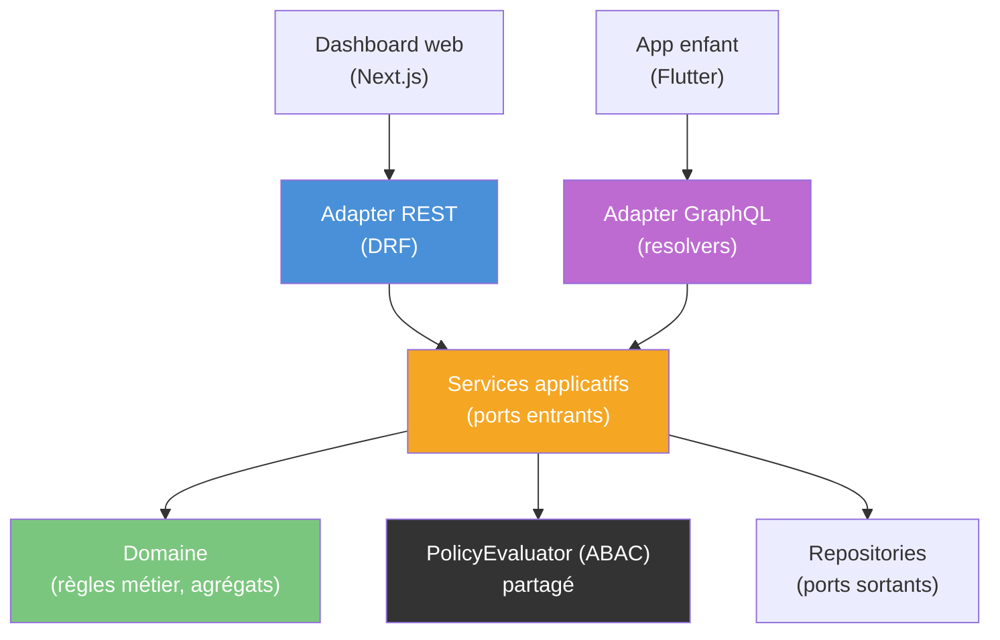

> **Statut** : 🔶 en cours · **Couvre** : Bloc 2 — C2.4

# Spécification API — Lenny & Co

> **Projet** : Lenny & Co — plateforme d'accompagnement des enfants porteurs de troubles DYS.
> **Périmètre de ce document** : introduction et choix du style d'API. Les contrats d'interface détaillés par bounded context suivront.
> **Pré-requis** : *Architecture Technique Backend* (monolithe modulaire, hexagonal, 2 bounded contexts, double barrière ABAC + RLS).

---

## Sommaire

1. [Le problème : deux clients, deux profils d'usage](#1-le-problème--deux-clients-deux-profils-dusage)
2. [Styles d'API évalués](#2-styles-dapi-évalués)
3. [Décision retenue : REST (web) + GraphQL (mobile)](#3-décision-retenue--rest-web--graphql-mobile)
4. [Pourquoi le double paradigme reste maîtrisé : les adapters entrants](#4-pourquoi-le-double-paradigme-reste-maîtrisé--les-adapters-entrants)
5. [Ce qui doit être traité deux fois — et comment](#5-ce-qui-doit-être-traité-deux-fois--et-comment)
6. [Sécurité spécifique à GraphQL](#6-sécurité-spécifique-à-graphql)

> **Sigles** : **REST** (Representational State Transfer) · **gRPC** (gRPC Remote Procedure Call, transport HTTP/2 + protobuf) · **BFF** (Backend-For-Frontend) · **ABAC** (Attribute-Based Access Control) · **RLS** (Row-Level Security) · **N+1** (anti-pattern : une requête par élément d'une liste) · **DTO** (Data Transfer Object).

---

## 1. Le problème : deux clients, deux profils d'usage

Le backend dessert deux clients aux contraintes très différentes :

- **Dashboard parent (web, Next.js)** — écrans de supervision relativement **stables**, consultés sur des réseaux confortables. Les vues sont prévisibles : liste d'enfants, fiche de progression, historique. Le sur-fetching y est peu pénalisant et le **cache HTTP** apporte beaucoup.
- **Application enfant (mobile, Flutter)** — écrans **composites** (un exercice agrège catalogue, profil, progression, encouragement) sur des réseaux **contraints et intermittents**. Multiplier les allers-retours ou sur-charger les réponses dégrade directement l'expérience.

Un même style d'API sert mal ces deux profils. C'est ce constat — et non un goût pour la nouveauté — qui motive l'analyse ci-dessous.

---

## 2. Styles d'API évalués

| Critère | **REST** | **GraphQL** | **gRPC** | **API métier tailor-made** |
|---|---|---|---|---|
| **Récupération des données** | Ressources fixes ; sur/sous-fetching fréquent | Le client décrit exactement ce qu'il veut | Méthodes typées (RPC) ; payload fixe par méthode | Endpoints taillés par cas d'usage ; pas de sur/sous-fetching |
| **Adapté au navigateur (web)** | Excellent (HTTP/JSON natif) | Bon | Faible (nécessite un proxy gRPC-Web) | Excellent |
| **Adapté au mobile contraint** | Moyen (allers-retours, sur-fetching) | **Excellent** (une requête, payload minimal) | Bon (binaire compact) | Bon, mais figé par cas d'usage |
| **Cache HTTP** | **Natif** (verbes, en-têtes, URL) | Difficile (POST unique, cache applicatif) | Non standard | **Natif** |
| **Sécurité fine** | Par endpoint (simple à raisonner) | Au champ + limites de profondeur/complexité (plus exigeant) | Par méthode | Par endpoint |
| **Couplage / évolution du contrat** | Contrat explicite, versionné | Contrat flexible, déprécation par champ | Contrat protobuf strict | Contrat ad hoc, peu standard |
| **Coût pour une équipe d'une personne** | Faible (outillage DRF mûr) | Modéré (schéma, resolvers, dataloader) | Élevé (toolchain, proxy web) | Modéré (réinvente du REST) |

**Lecture.** REST excelle côté web et cache, peine côté mobile. GraphQL est taillé pour le mobile composite mais déplace la complexité côté sécurité. gRPC brille en inter-services mais s'intègre mal à un navigateur — or nous n'avons pas de besoin inter-services (monolithe). L'API tailor-made résout l'over-fetching, mais au prix de la standardisation : on réécrit, cas par cas, ce que REST et GraphQL offrent déjà.

---

## 3. Décision retenue : REST (web) + GraphQL (mobile)

Nous exposons **deux adapters d'API sur le même backend** : REST pour le dashboard web, GraphQL pour l'application mobile. Trois arguments :

- **Adéquation au profil d'usage.** Le web consomme des vues stables : REST + cache HTTP est simple, robuste et performant. Le mobile compose des écrans agrégés sur réseau contraint : GraphQL supprime les allers-retours et le sur-fetching, là où ils coûtent le plus.
- **Surcoût circonscrit par l'architecture.** REST et GraphQL ne sont que des **adapters entrants** au sens hexagonal : ils appellent les **mêmes services applicatifs**. Le domaine, les règles métier et le contrôle d'accès ne sont pas dupliqués (cf. §4). Le double paradigme ne touche que la couche d'adaptation.
- **gRPC et tailor-made écartés, mais pour de bonnes raisons.** gRPC vise l'inter-services, absent ici, et s'intègre mal au navigateur. L'API tailor-made reviendrait à réimplémenter à la main, endpoint par endpoint, ce que REST et GraphQL standardisent — gain marginal, perte de standardisation et de documentation automatique.

> **Garde-fou.** Ce choix n'est défendable *que* parce que l'architecture hexagonale neutralise la duplication. Sans elle, maintenir deux API en solo serait un signal de sur-ingénierie. La section suivante en fait la démonstration.

---

## 4. Pourquoi le double paradigme reste maîtrisé : les adapters entrants

En hexagonal, une API est un **adapter** branché sur un **port entrant** (un *use case*). Le cœur ne sait pas s'il est sollicité en REST ou en GraphQL.

**Ce qui n'est écrit qu'une fois** (partagé par les deux adapters) :

- les **services applicatifs** (use cases) et toute la **logique de domaine** ;
- le **contrôle d'accès ABAC** (`PolicyEvaluator`), appelé par la couche application, donc commun aux deux protocoles ;
- la **Row-Level Security** PostgreSQL, qui s'applique au niveau des données quel que soit l'appelant ;
- les **repositories** et le mapping de persistance.

Concrètement, un adapter REST traduit une requête HTTP en commande, et un resolver GraphQL traduit un champ de requête en *la même* commande. Tous deux délèguent à `service.execute(command)`. La règle métier ne connaît qu'un seul chemin.

---

## 5. Ce qui doit être traité deux fois — et comment

Par honnêteté technique, le double paradigme a un coût réel, localisé dans la couche d'adaptation. Nous le bornons explicitement :

| Élément dédoublé | Pourquoi | Mitigation |
|---|---|---|
| Câblage d'authentification | Chaque protocole a son point d'entrée | Même mécanisme de jeton (JWT) ; vérification factorisée dans un composant partagé appelé par les deux adapters |
| Schéma / contrat | REST décrit des ressources, GraphQL un schéma typé | Générés au plus près des DTO communs ; une seule source de vérité métier (les commandes/queries applicatives) |
| Sérialisation | Serializers DRF vs types GraphQL | Mappés depuis les mêmes DTO de sortie, pas depuis le domaine directement |
| Autorisation fine | GraphQL expose des champs, pas des URLs | Mêmes décisions ABAC ; ajout de garde-fous propres à GraphQL (cf. §6) |

Le principe directeur : **ne jamais laisser un adapter porter une règle métier**. Tout ce qui est dédoublé est de la *traduction de protocole*, jamais de la *décision*.

---

## 6. Sécurité spécifique à GraphQL

La flexibilité de GraphQL élargit la surface d'attaque par rapport à des endpoints REST figés. Quatre garde-fous, cohérents avec la double barrière du backend :

- **Autorisation au champ** déléguée au `PolicyEvaluator` ABAC partagé — un champ sensible (détail de trouble DYS) reste soumis à la `CareRelation` et au profil d'accompagnement, exactement comme en REST.
- **Limite de profondeur et de complexité** des requêtes, pour empêcher une requête imbriquée de surcharger la base (déni de service).
- **Requêtes pré-enregistrées (*persisted queries* / allowlist)** en production : le mobile n'envoie qu'un identifiant de requête connue, pas une requête arbitraire — réduit drastiquement la surface.
- **Introspection désactivée en production**, pour ne pas exposer publiquement le schéma complet.

La **Row-Level Security** PostgreSQL demeure la seconde barrière : même une requête GraphQL malformée qui franchirait la couche applicative ne récupérerait que les lignes autorisées au niveau du moteur.

---

> **Prochaine étape.** Détailler, par bounded context, les **contrats d'interface** : ressources et verbes REST côté *Identity & Access* et *Learning & Progress*, schéma GraphQL (types, queries, mutations) côté mobile, et le mapping commun vers les services applicatifs.
