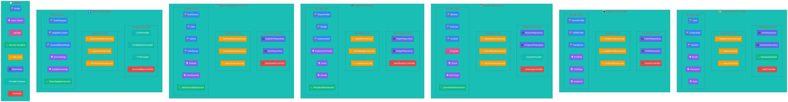
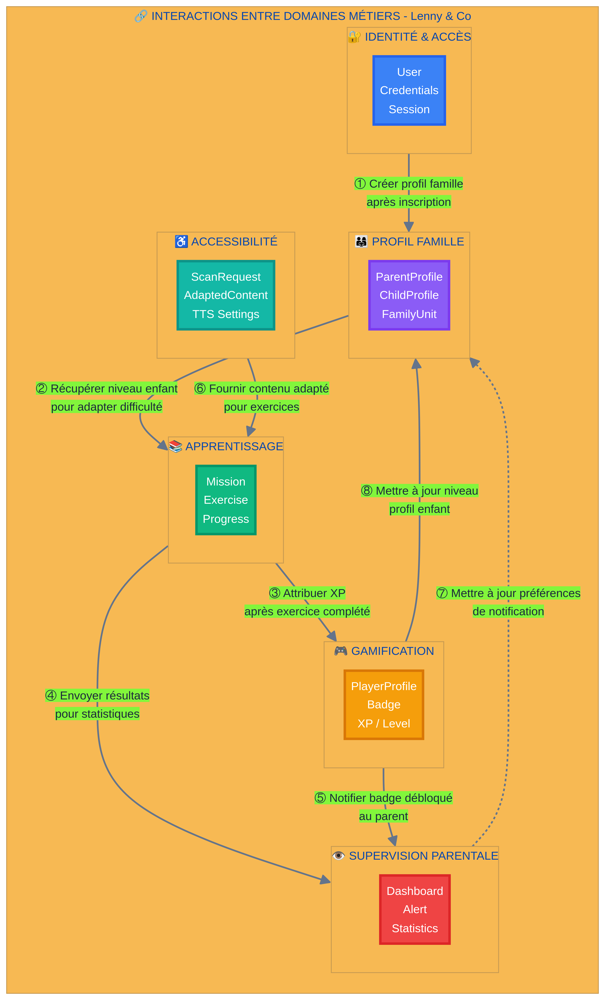
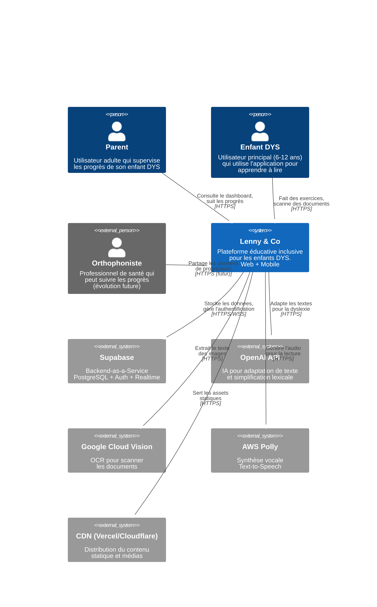
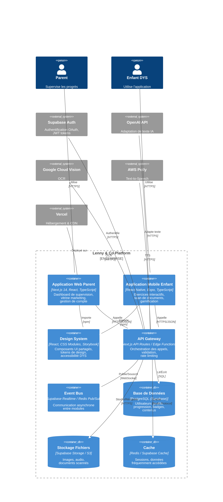
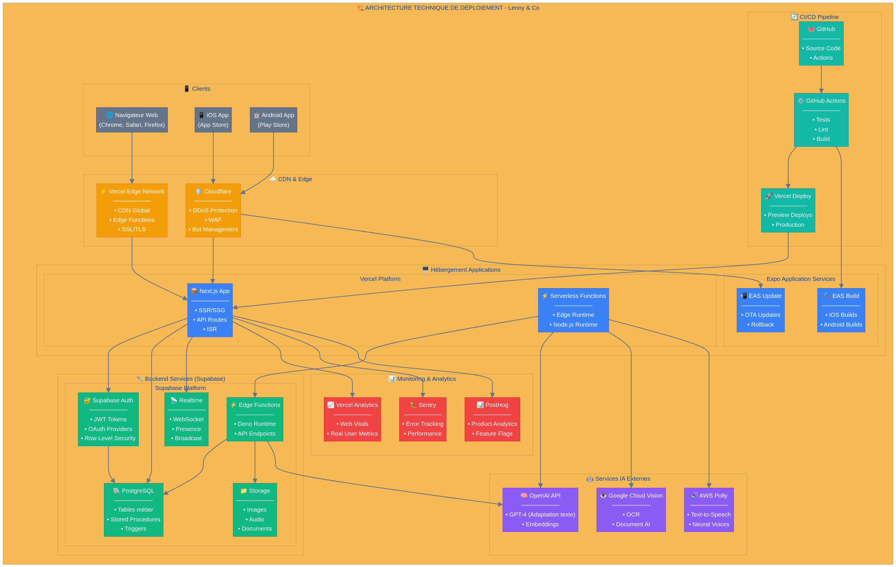

# Lenny & Co — Documentation d'Architecture

## Vue d'ensemble

Ce dossier contient la documentation complète de l'architecture de **Lenny & Co**, une plateforme éducative inclusive pour les enfants présentant des troubles DYS (dyslexie, dysorthographie).

L'architecture suit les principes de l'**Architecture Hexagonale** (Ports & Adapters) et du **Domain-Driven Design (DDD)** pour garantir une séparation claire des responsabilités, une testabilité optimale et une évolutivité maîtrisée.

---

## Structure de la Documentation

```
docs/architecture/
├── README.md                           # Ce fichier
├── 01-domaines-metiers.md              # Découpage en domaines métiers (Bounded Contexts)
├── 02-architecture-hexagonale.md       # Architecture hexagonale détaillée par module
├── 03-architecture-technique-c4.md     # Architecture technique (modèle C4)
└── diagrams/                           # Schémas d'architecture
    ├── 01-module-decomposition.png     # Vue globale de la décomposition des modules
    ├── 02-module-identity-detail.png   # Détail du module Identité & Accès
    ├── 03-module-learning-detail.png   # Détail du module Apprentissage
    ├── 04-domain-interactions.png      # Interactions entre domaines métiers
    ├── 05-domain-commands-events.png   # Commandes et événements entre domaines
    ├── 06-c4-context.png               # C4 Niveau 1 : Contexte Système
    ├── 07-c4-containers.png            # C4 Niveau 2 : Conteneurs
    └── 08-technical-deployment.png     # Architecture de déploiement
```

---

## Domaines Métiers

L'application est découpée en **6 domaines métiers** (Bounded Contexts) :

| Domaine | Responsabilité | Entités principales |
|---------|----------------|---------------------|
| 🔐 **Identité & Accès** | Authentification, autorisation, sessions | User, Credentials, Session |
| 👨‍👩‍👧 **Profil Famille** | Gestion des profils parents/enfants | ParentProfile, ChildProfile, FamilyUnit |
| 📚 **Apprentissage** | Exercices, missions, progression | Mission, Exercise, Progress |
| 🎮 **Gamification** | XP, badges, niveaux, récompenses | PlayerProfile, Badge, Achievement |
| 👁️ **Supervision Parentale** | Dashboard, alertes, statistiques | Dashboard, Alert, Statistic |
| ♿ **Accessibilité** | OCR, adaptation de texte, TTS | ScanRequest, AdaptedContent |

---

## Schémas d'Architecture

### 1. Décomposition des Modules

Vue globale montrant la structure hexagonale de chaque module avec ses entités, value objects, services et repositories.



### 2. Interactions entre Domaines

Schéma conceptuel représentant les commandes et flux de données entre les domaines métiers.



### 3. Architecture Technique (C4)

#### Niveau 1 : Contexte Système


#### Niveau 2 : Conteneurs


#### Architecture de Déploiement


---

## Principes Architecturaux

### Architecture Hexagonale

```
┌─────────────────────────────────────────────────────────────┐
│                    ADAPTATEURS PRIMAIRES                    │
│              (Controllers, API Routes, UI)                  │
└─────────────────────────────────────────────────────────────┘
                              │
                              ▼
┌─────────────────────────────────────────────────────────────┐
│                     PORTS PRIMAIRES                         │
│                    (Use Cases / Interfaces)                 │
└─────────────────────────────────────────────────────────────┘
                              │
                              ▼
┌─────────────────────────────────────────────────────────────┐
│                      DOMAINE MÉTIER                         │
│         (Entités, Value Objects, Services, Events)          │
│                    🎯 CŒUR PUR 🎯                           │
└─────────────────────────────────────────────────────────────┘
                              │
                              ▼
┌─────────────────────────────────────────────────────────────┐
│                    PORTS SECONDAIRES                        │
│              (Repository Interfaces, Gateways)              │
└─────────────────────────────────────────────────────────────┘
                              │
                              ▼
┌─────────────────────────────────────────────────────────────┐
│                  ADAPTATEURS SECONDAIRES                    │
│           (Repositories, API Clients, Providers)            │
└─────────────────────────────────────────────────────────────┘
```

### Avantages de cette Architecture

| Avantage | Description |
|----------|-------------|
| **Testabilité** | Le domaine peut être testé sans infrastructure |
| **Flexibilité** | Les adaptateurs peuvent être remplacés sans toucher au métier |
| **Évolutivité** | Chaque module peut évoluer indépendamment |
| **Maintenabilité** | Séparation claire des responsabilités |
| **Indépendance** | Le code métier ne dépend d'aucun framework |

---

## Stack Technique

### Frontend

| Technologie | Utilisation |
|-------------|-------------|
| **Next.js 14** | Application Web (SSR/SSG) |
| **React Native + Expo** | Application Mobile |
| **TypeScript** | Typage statique |
| **CSS Modules** | Styling isolé |
| **Storybook** | Design System |

### Backend

| Service | Fournisseur |
|---------|-------------|
| **Base de données** | Supabase (PostgreSQL) |
| **Authentification** | Supabase Auth |
| **Stockage** | Supabase Storage |
| **Temps réel** | Supabase Realtime |

### Services IA

| Service | Fournisseur |
|---------|-------------|
| **Adaptation de texte** | OpenAI GPT-4 |
| **OCR** | Google Cloud Vision |
| **Text-to-Speech** | AWS Polly |

### Infrastructure

| Composant | Service |
|-----------|---------|
| **Hébergement** | Vercel |
| **CDN** | Cloudflare |
| **CI/CD** | GitHub Actions |
| **Monitoring** | Sentry + PostHog |

---

## Pour Commencer

### Lecture recommandée

1. **[01-domaines-metiers.md](01-domaines-metiers.md)** — Comprendre le découpage fonctionnel
2. **[02-architecture-hexagonale.md](02-architecture-hexagonale.md)** — Détails de l'architecture par module
3. **[03-architecture-technique-c4.md](03-architecture-technique-c4.md)** — Vue technique et déploiement

### Structure de code recommandée

```
src/
├── modules/
│   ├── identity/
│   │   ├── domain/
│   │   │   ├── entities/
│   │   │   ├── value-objects/
│   │   │   ├── services/
│   │   │   ├── events/
│   │   │   └── ports/
│   │   ├── application/
│   │   │   ├── commands/
│   │   │   ├── queries/
│   │   │   └── handlers/
│   │   └── infrastructure/
│   │       ├── adapters/
│   │       └── persistence/
│   ├── family/
│   ├── learning/
│   ├── gamification/
│   ├── supervision/
│   └── accessibility/
├── shared/
│   ├── kernel/           # Code partagé entre modules
│   └── infrastructure/   # Infrastructure commune
└── apps/
    ├── web/              # Application Next.js
    └── mobile/           # Application React Native
```

---

## Auteur

**Cécile Hirschauer**  
ADA Tech School - EADL M3  
Janvier 2026

---

## Licence

Ce projet est sous licence MIT. Voir le fichier [LICENSE](../../LICENSE) pour plus de détails.
